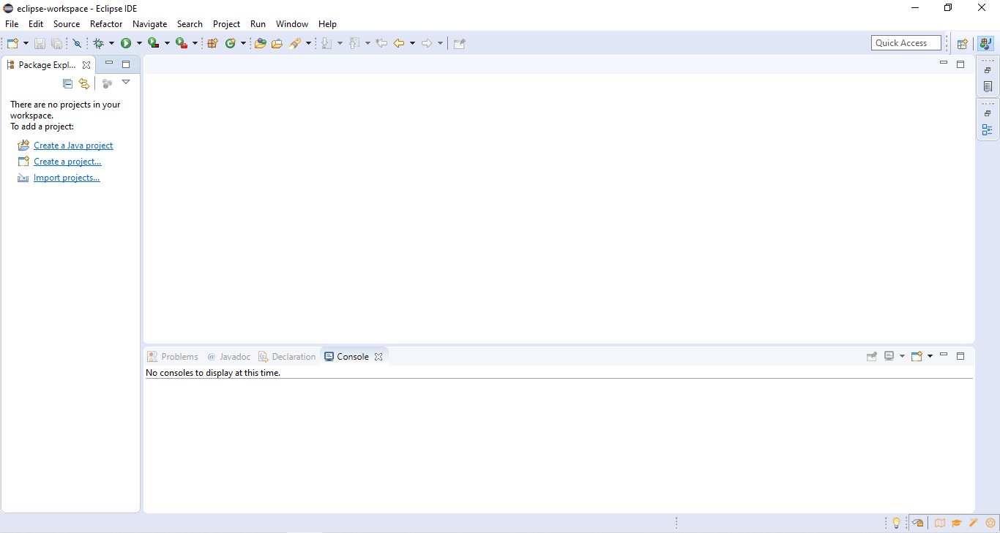
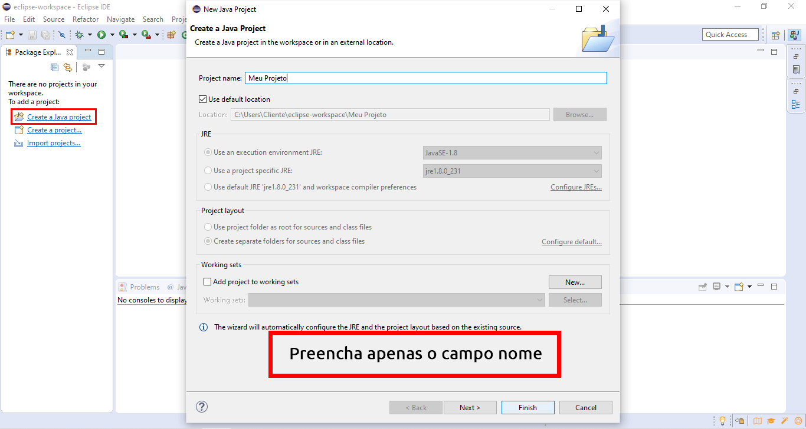

<h1 align="center">
    
</h1>

<h2 align="center">

  💻 Exercícios de Fundamentos da Programação em Java
</h2>

  <a href="#two_hearts-o-projeto">O Projeto</a>&nbsp;&nbsp;&nbsp;|&nbsp;&nbsp;&nbsp;
  <a href="#key-como-utilizar">Como Utilizar</a>&nbsp;&nbsp;&nbsp;|&nbsp;&nbsp;&nbsp;
  <a href="#rocket-tecnologias">Tecnologias</a>&nbsp;&nbsp;&nbsp;|&nbsp;&nbsp;&nbsp;
  <a href="#white_check_mark-licença">Licença</a>&nbsp;&nbsp;&nbsp;|&nbsp;&nbsp;&nbsp;

 

## :two_hearts: O Projeto

Estes exercícios foram desenvolvidos durante a disciplina de Programação Básica do curso de Engenharia da Computação do IF Goiano. 

Organizei por lista de exercícios cujo pdf também está incluso neste repositório.

## :key: Como Utilizar

Você pode utilizar este exercícios para estudar, clarear a mente, etc.

### **Requisitos**:
- [x] Ter a IDE Eclipse instalada &#8594; [Download Eclipse IDE](https://www.eclipse.org/downloads/)

### **Passo a Passo**:

1. Faça o download dos exercícios → [Pacote de Exercícios](https://github.com/patryckgratao/fundamentos-programacao-java/archive/master.zip/)
2. Abra o Eclipse até aparecer esta imagem:

3. Crie um Projeto Java

4. Clique em `File → Import... `
5. Após abrir a janela clique em `General → Archive File → Next`
6. Clique em `browse` e escolha o arquivo que você baixou no passo 1
7. Clique em `Finish`

Pronto, o projeto foi importado com todos os códigos e listas em pdf. 

Aproveite!

## :rocket: Tecnologias

Os exercícios foram desenvolvidos usando:

- Backend &#8594; Java
- IDE &#8594; Eclipse

## :white_check_mark: Licença

Distribuído sob a licença MIT, livre para uso e edição.

---

Feito com ❤️ por **Patryck Gratão**